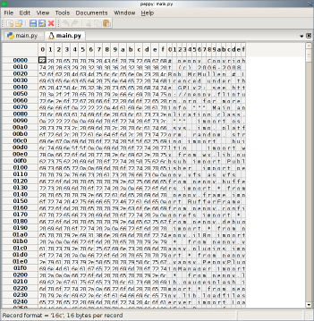

.. _hexedit:

******************
HexEdit Major Mode
******************

HexEdit mode provides a means to edit binary data, that is: to edit individual
bytes of a file.  It doesn't matter what type of file it is, whether it's a
text file or an image or an mp3 or a file full of IEEE floating point values
-- HexEdit can display the file.

Currently there are a small number of limitations.  First is that the file size
is limited: peppy can only edit files that can fit into memory.  And second,
if there are other views of the file (say it is a text file and one view is
in Fundamental Mode and the other is HexEdit), the file must be viewed as
raw bytes without an encoding.  This is due to limitations in the styled text
control that is used as the data storage mechanism.

The Editing Window
==================

Peppy provides an editing window that shows the data fairly standard hex editor
form: two sections, one showing the bytes as hexadecimal values, and the other
section showing the same bytes as ASCII characters.
