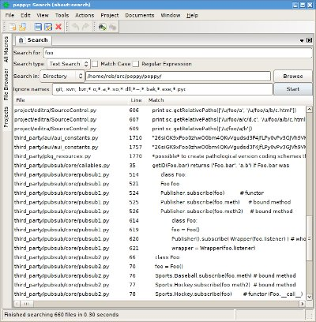
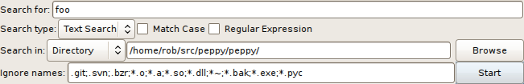
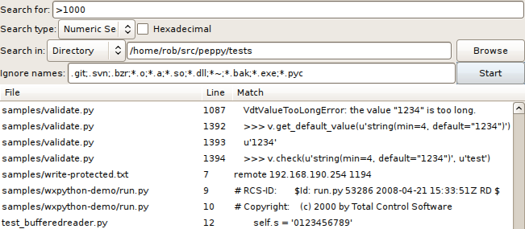
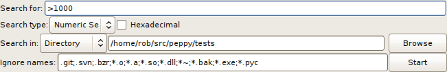

***********
Search Mode
***********

.. _search:

Search Mode scans through a set of files looking for matches.  It is similar
to the 'grep' command in unix, but is much more powerful because it can be
extended to search for matches based on context or based on characteristics in
certain types of files.

The Search Window
=================

The main search mode window is split into two sections, the top is for entering
search criteria, and the bottom is a list that displays the results of the
search.

Search Criteria
---------------

The top section of the search mode window contains the search criteria,
defining what you are searching for and which files to scan.  There are four
sections to the search criteria: the search string, the type of search, how to
choose the files to search, and the files to ignore.

The first line is the search string, which in the simplest case is the exact
string that you wish to find.  In more complex cases, it can be a regular
expression, a comparison, or another format depending on the type of search.

The type of search is what makes Peppy's search so powerful.  The type is
selected by a pull-down list, and additional types can be added through
plugins.  The default search types are **Text Search** which provides the usual
text search operations (whether or not the case is significant, and regular
expressions for advanced pattern matching), and **Numeric Search** which scans
through text files and compares numbers that it finds with the comparison
defined by the search string.  The search types are described in more detail
below.

Files can be chosen in a number of ways by selecting from a pull-down list.
(Note this can also be extended by plugins.) Currently, the available options
are **Directory**, **Project**, and **Open Documents**.  The **Directory**
option will perform its search starting with all files in the named directory,
and continue recursively through all subdirectories.  The **Project** option
will limit itself to only those files contained in the selected project (see
:ref:`projects` for more information and how to define projects).  The **Open
Documents** option limits the search to only those documents that are already
open in peppy; that is, only those documents that appear in the **Documents**
menu.

Finally, the **Ignore Names** criteria is a list of filename extensions to skip
in the search process.

Pressing the **Start** button (or using either the **Actions -> Start Search**
menu item or the start search icon on the toolbar) will begin the search
process.  An error that causes the search to fail will show up in the status
bar, otherwise the search will display results as they are discovered.  Note
that you can continue to work in other tabs or peppy windows as the search
operates because the search is performed in a separate thread.

Search Results
--------------

The bottom section of the search mode window is a list that will be populated
with the results of the search.  The list is broken up into three columns: the
filename of the match, the line number, and the matching line.  Each line in
the list represents a matching line in a file.

The first column contains the filename of the match.  Common directory prefixes
will be removed to save space if searching in a directory or project where all
the matches have a common directory prefix.

The second column contains the line number of the match.  Line numbers start
from 1.  Note that multiple matches on the same line will only be shown once
in the list.

The third column contains the matching line.  In future versions, multiple
matches in the line will be highlighted, but at the moment only the line
itself is displayed.

Search Types
============

One of the differences between peppy and other search programs is the search
type.  Using the search type, text can be matched based on criteria, not just
matching characters.

Currently, there are two search types distributed with peppy: **Text Search**
and **Numeric Search**.

Text Search
-----------

Text search is much like the basic search capabilities of normal editors.  You
can search with or without case sensitivity, and you can choose to use regular
expressions for advanced searching.

By default, text is matched without regard to case.  If you would like case to
be significant in the match, check the **Match Case** checkbox.

Regular expressions are available by checking the **Regular Expression**
checkbox.  The search string is then taken as a regular expression (or
*regex*) and lines in files will be matched against the regex.  Regular
expressions, if you haven't used them much, can be complicated. From  the Python__ documentation, here's a short summary of regular expressions:

__ http://docs.python.org/release/2.5/lib/re-syntax.html

    Regular expressions can contain both special and ordinary characters. Most ordinary characters, like **A**, **a**, or **0**, are the simplest regular expressions; they simply match themselves. You can concatenate ordinary characters, so **last** matches the string 'last'. (In the rest of this section, we'll write regexes in this bold style, and strings to be matched 'in single quotes'.)

    Some characters, like **|** or **(**, are special. Special characters either stand for classes of ordinary characters, or affect how the regular expressions around them are interpreted.

    Some of the special characters include:

    **.**
        (Dot.) In the default mode, this matches any character except a newline. If the DOTALL flag has been specified, this matches any character including a newline.

    **^**
        (Caret.) Matches the start of the string.

    **$**
        Matches the end of the string or just before the newline at the end of the string. **foo** matches both 'foo' and 'foobar', while the regular expression **foo$** matches only 'foo'.

    **\***
        Causes the resulting RE to match 0 or more repetitions of the preceding RE, as many repetitions as are possible. **ab\*** will match 'a', 'ab', or 'a' followed by any number of 'b's.

    **+**
        Causes the resulting RE to match 1 or more repetitions of the preceding RE. **ab+** will match 'a' followed by any non-zero number of 'b's; it will not match just 'a'.

    **?**
        Causes the resulting RE to match 0 or 1 repetitions of the preceding RE. **ab?** will match either 'a' or 'ab'.

    **\\**
        Either escapes special characters (permitting you to match characters like "\\", "?", and so forth), or signals a special sequence; special sequences are discussed below.

    **[]**
        Used to indicate a set of characters. Characters can be listed individually, or a range of characters can be indicated by giving two characters and separating them by a "-". Special characters are not active inside sets. For example, **[akm$]** will match any of the characters "a", "k", "m", or "$"; **[a-z]** will match any lowercase letter, and **[a-zA-Z0-9]** matches any letter or digit. Character classes such as **\\w** or **\\S** (defined here__) are also acceptable inside a range. If you want to include a "]" or a "-" inside a set, precede it with a backslash, or place it as the first character. The pattern **[]]** will match ']', for example.

        You can match the characters not within a range by complementing the set. This is indicated by including a "^" as the first character of the set; "^" elsewhere will simply match the "^" character. For example, **[^5]** will match any character except "5", and **[^^]** will match any character except "^".

    **|**
        A|B, where A and B can be arbitrary REs, creates a regular expression that will match either A or B. An arbitrary number of REs can be separated by the "|" in this way. This can be used inside groups (see below) as well. As the target string is scanned, REs separated by "|" are tried from left to right. When one pattern completely matches, that branch is accepted. This means that once A matches, B will not be tested further, even if it would produce a longer overall match. In other words, the "|" operator is never greedy. To match a literal "|", use **\\|**, or enclose it inside a character class, as in **[|]**.

    **(** ... **)**
        Matches whatever regular expression is inside the parentheses, and indicates the start and end of a group; the contents of a group can be matched later in the string with the **\\**\ *number* special sequence, described below. To match the literals "(" or ")", use **\\(** or **\\)**, or enclose them inside a character class: **[(]** or **[)]**.

    **\\**\ *number*
        Matches the contents of the group of the same number. Groups are numbered starting from 1. For example, **(.+) \1** matches 'the the' or '55 55', but not 'the end' (note the space after the group). This special sequence can only be used to match one of the first 99 groups. If the first digit of number is 0, or number is 3 octal digits long, it will not be interpreted as a group match, but as the character with octal value number. Inside the "[" and "]" of a character class, all numeric escapes are treated as characters.

__ http://docs.python.org/release/2.5/lib/re-syntax.html

See http://docs.python.org/release/2.5/lib/re-syntax.html for descriptions
of more advanced regular expression components, or see the following for
additional references:

 * http://en.wikipedia.org/wiki/Regular_expression
 * http://www.regular-expressions.info/reference.html

Numeric Search
--------------

Beyond simple text or regular expression searching, Peppy can search through
text files for numbers and perform matches based on comparisons with a
reference number.  Selecting the **Numeric Search** item from the **Search Type** pulldown menu activates this search type.

The **Search for:** field then becomes the place to specify the reference
number and the comparison operator.  For example, specifying ">1000" will
result in matches for all lines that have a number in them where the number
is greater than 1000.  Operators available are **<**, **<=**, **=**, **>=**,
**>** and all whitespace is ignored.

By default the search is performed using decimal numbers (both floating
point and integer values ore found), but the **Hexadecimal** option may be
selected by selecting the checkbox.  Hex search finds all hex values in the
text that are formatted with a leading **0x** or trailing **h** (like 0x2468,
0xdeadbeef, fdb97531h, 2badh, etc.) and compares them to the reference value.
The same comparison operators are available when using hexadecimal mode.

Expandability
-------------

The types of searches can be expanded through Peppy plugins, so more types may
be available.
