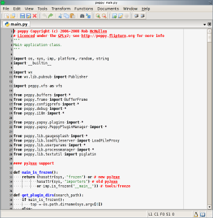

********
Concepts
********

Peppy provides a fairly standard looking graphical user interface that should
be familiar if you've used a text editor before.  However, there are several
unique features that may not be obvious, and these are described here.

User Interface
==============

Top Level Windows
-----------------

Peppy can display multiple top level windows, each of which can display an
arbitrary number of tabs.  Each tab contains exactly one major mode, which is
to say that each tab contains one view of a document.

.. _majormodes:

Major Modes
-----------

A major mode is a specific type of user interface window for a particular
type of file.  For example, the Python Major Mode in the image above shows a
typical text editor window with line numbers on the left side, a cursor for
typing, and scroll bars for moving back and forward in the document.

Other major modes like HexEdit:

.. image:: peppy-hexedit-mode.png

provide a different type of user interface.  Some types of major modes are
specific to a type of file and some are more general and can be used to edit
many types of files.

Menu Bar
--------

The menu bar of peppy is dynamic, and is customized depending on the major
mode.  Switching major modes by changing tabs or loading a new file causes
the menu bar to be modified so that it only displays items relevant to the
current major mode.  This prevents cluttering the user interface with a bunch
of grayed out items that don't apply to what you're editing at the moment.

Tool Bar
--------

The tool bar is likewise dynamic, and shows only those tool bar items that are
appropriate to the current major mode.  The tool bar may also be turned off if
you don't like a tool bar or if you want a little extra vertical space for the
major mode.

Files and URLs
==============

All files in peppy are treated as being referenced by a URL, even local files.
This abstraction makes it easy to add support for new URL schemes to load
files, and for the most part, it makes no difference what scheme has been
used to load a file.  Currently, thanks to the `itools virtual file system
<http://www.ikaaro.org/itools/>`_, support for loading files over http is
provided.  Other file system support, like sftp (secure FTP) and fish (files
over ssh protocol) is planned.

There are also some built-in schemes, like **about:** that used for read only
documentation, **mem:** used for an in-memory temporary file system, **tar:**
used for read only access to files contained within tar files, and more
esoteric schemes like **aptus:** which is used in the fractal renderer.

Automatic Recognition of File Type
----------------------------------

Another unique aspect of peppy is the lengths to which it goes to identify
a file.  Because most text editors assume that the file that you're loading
is a text file, they don't spend much time trying to figure out what type of
file it really is.  They just look at the file extension and assume that it
correctly identifies the text within it.

Peppy does take into account the filename and extension when identifying a file,
but it doesn't *just* do that -- it also provides several hooks in the file
loading process to examine the URL or the contents of the file to determine
what type of file it is.  This set of heuristics allows peppy to correctly
determine the major mode to use even if the file is incorrectly labeled, or in
cases where the same file extension is used for different types of data.

Documents
=========

A URL uniquely identifies a file on some file system, and peppy uses the URL
as the identifier of a loaded document.  Only one copy of a document exists in
peppy, but it can have many different views in the user interface.  And, even
if no more views exist of the document, it is still kept in memory by peppy
until you explicitly delete it from memory.

Opened files appear in the *Documents* menu, and a particular document can be
opened in any peppy window by selecting it from the menu.  A new tab containing
a view of the document will appear, using its default major mode.  Deleting
the tab only causes the tab to go away; it doesn't delete the document.  Only
when closing the document will the document be removed from memory.

