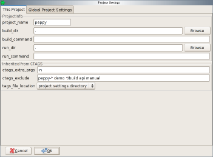
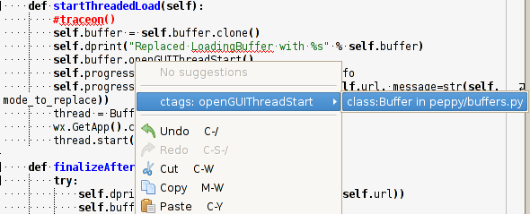

********
Projects
********

.. _projects:

Peppy's Concept of Projects
===========================

Peppy uses a very simple definition of projects based on directories.
Any directory can be considered as the top level of a project, including
directories residing in other projects.  Peppy determines membership in a
project by starting at the source file and marching upwards through the path
until it finds a special marker than indicates the directory is a project.
By default, this marker is a special directory at the root of the project
directory called '.peppy-project'.

Features available in projects include source code control operations like
viewing the status of files and committing changes, template files used to
generate boilerplate text for newly created files, and menu and toolbar items
to control the build process and to run the application.

Setting Up Projects
===================

You can either create a new project from within peppy, or tell peppy about an
existing project.

New Projects
------------

Choose the File -> New -> Project...  menu item to create a new project
directory.  Use this when starting a project from scratch.

A dialog box will appear allowing you to chose where to place the new
directory, and after selecting that will show the project configuration dialog
allowing you to set some project specific options.

Existing Projects
-----------------

If you have an existing project in a directory, you can tell peppy about it
by using th File -> New -> Project From Existing Code...  menu item.  This
also prompts for a directory, but this time it is looking for you to enter
an existing directory.  After entering the directory, it continues on to the
project configuration dialog.

Project Configuration Dialog
----------------------------

This dialog contains two tabs, one showing the configuration information
for this project and the other containing global settings that apply to all
projects.

Source Code Control
===================

Most projects will be using some form of source code management system to keep
track of changes.  (If your project doesn't use source control, you should
consider it strongly!) Peppy currently supports Git, SVN, Bzr, and CVS systems.

Peppy displays some source control information in the Projects
springtab, showing the current status of each file in a project.

Templates
=========

Templates are boilerplate code that will be inserted when creating a new file
of a specific type.  There are two classes of templates, global templates
that don't depend on a project, and project templates that apply only to the
specific project that you're using.  Global templates are stored in the peppy
configuration directory, while project templates are stored within the project
directory.

Note that project templates override global templates, so creating a file within
a project directory will use the project template instead of the global one.

Creating Templates
------------------

Templates are associated with major modes.  Creating a template begins with
deciding what major mode to use.  After creating some source code in that
major mode, you can either save it as a global template or as a project
template using the Project -> Templates menu item.  Note that the template
will only be associated with that major mode and not subclasses of the major
mode.  So, for instance, a template for FundamentalMode will not be used when
creating a new PythonMode file.

Building
========

A build command can be associated with the project using the project
configuration dialog.  Only after entering a command with the Project ->
Build...  menu item (and associated toolbar icon) be active.

You can specify the build directory using the project settings dialog.  This
directory can be an absolute directory, or can be relative to the project
directory.

In general, this only applies to projects using compiled languages like C, C++,
or java.  Any messages output by the build process will be displayed in an
output sidebar.

Running
=======

You can also associate an executable with the project that will allow you
to test the program using the Project -> Run...  menu item (and associated
toolbar icon).  As with the build process, you can specify the directory in
which the executable will be run, and any command line arguments.

CTAGS Support
=============

Peppy uses the `Exuberant CTAGS`__ program to generate cross references among
the source files within the project.  Installing this program will provide a
context menu entry when you right click on a syntax element in the source code:

Selecting the cross reference will cause peppy to load the referenced file (or
switch tabs to the file if it's already loaded) and jump to the line number of
the reference.

Currently, the tags file must be kept up to date manually.  Select the Project
-> Rebuild Tag File menu option to recreate it.

__ http://ctags.sourceforge.net/
